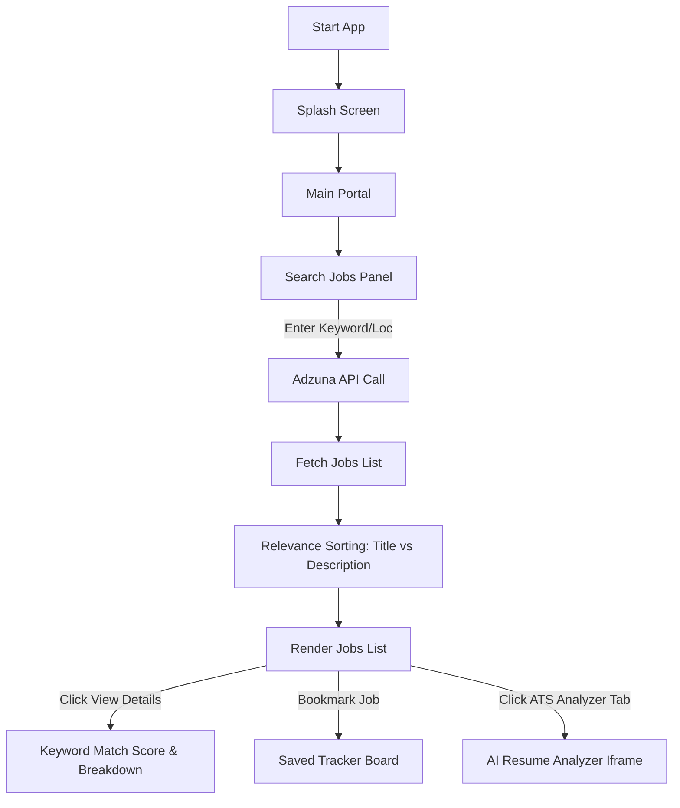
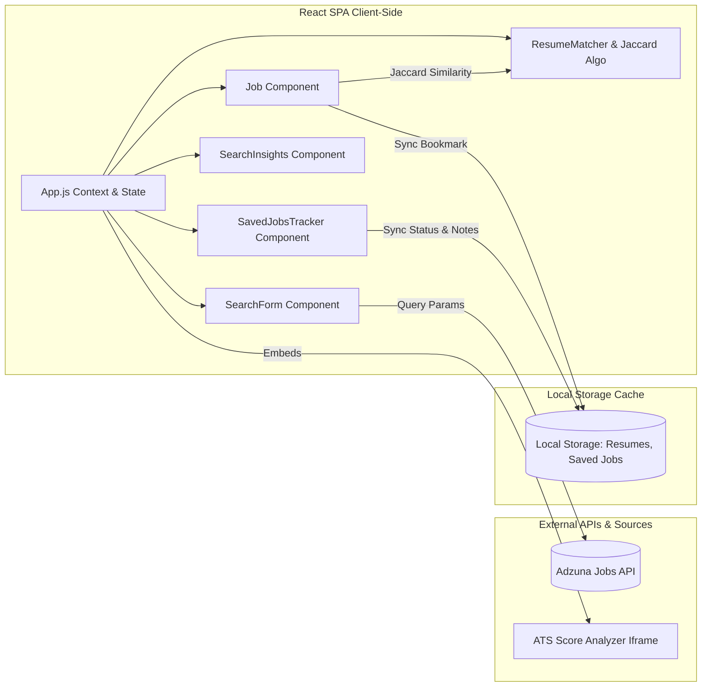

# Jobs Search and Apply React

[](https://app.netlify.com/projects/jobssearchandapply/deploys)

A premium, glassmorphic React portal for searching, tracking, and applying for jobs with intelligent resume matching and real-time analytics.

### 🌐 [Live Site](https://jobssearchandapply.netlify.app/)

---

## 🛠️ Tech Stack & Dependencies

| Technology | Logo / Icon | Version | Description |
| :--- | :---: | :---: | :--- |
| **React** |  | `^16.13.1` | Core UI library for component-based modular rendering. |
| **React Bootstrap** |  | `^1.2.2` | Responsive grid layouts and basic mobile scaffolding. |
| **Semantic UI React** |  | `^2.1.5` | Premium interactive interface components (Icon, Statistic, Grid). |
| **AOS (Animate On Scroll)** |  | `^2.3.4` | Smooth transitions and layout animations triggered on scroll. |
| **Axios** |  | `^0.19.2` | Promise-based HTTP client to fetch data from the Adzuna API. |
| **React Markdown** |  | `^4.3.1` | Safely parses and renders Markdown job descriptions. |

---

## 📂 Project Directory Structure

```text
Jobs-Search-and-Apply-React/
├── public/
│   ├── index.html
│   └── favicon.ico
├── src/
│   ├── Footer/
│   │   ├── Footer.jsx
│   │   └── Footer.css
│   ├── Insights/
│   │   ├── SearchInsights.js
│   │   └── SearchInsights.css
│   ├── Matcher/
│   │   ├── ResumeMatcher.js
│   │   ├── ResumeMatcher.css
│   │   └── matchAlgorithm.js
│   ├── SplashScreen/
│   │   ├── SplashScreen.jsx
│   │   └── SplashScreen.css
│   ├── Tracker/
│   │   ├── SavedJobsTracker.js
│   │   └── SavedJobsTracker.css
│   ├── App.js
│   ├── App.css
│   ├── index.js
│   ├── Job.js
│   ├── useFetchJobs.js
│   ├── useTypewriter.js
│   └── serviceWorker.js
├── netlify.toml
├── package.json
└── README.md
```

---

## 📊 Application Flow Chart



---

## 🏗️ Architecture Design



---

## 🚀 Key Features

- **🎨 Premium Theme System**: Sleek glassmorphic dark theme and a soft, low-contrast, eye-friendly light theme designed to minimize eye strain.
- **💱 Dynamic Country & Currency Localization**: Automatically maps salary digits and currency denominations based on selected countries (e.g. correct lakh grouping `₹20,00,000` for India via `en-IN` locale).
- **📊 Real-time Search Insights**: High-level statistical summaries (Estimated average/max salaries, top hiring companies, and top employment locations) for active search results.
- **📄 Local Resume Matcher**: Paste or upload `.txt` resumes to run client-side Jaccard keyword matching, displaying a Rocket fit percentage score, matched skills, and suggested key terms to add.
- **💼 Saved Jobs Tracker Board**: A local kanban/log board to track job applications across statuses (`Bookmarked`, `Applied`, `Interviewing`, `Offer Received`, `Rejected`) with persistent custom notes.
- **🤖 Integrated ATS Resume Analyzer**: Seamless integration of the AI Resume Analyzer (`https://atsscore.fcruz.org/`) within a dedicated tab.
- **✨ Infinite Scroll / Load More**: Single-page rendering that appends results on demand instead of pagination.
- **🔍 Advanced Relevance Tuning**: Auto-ranks search outcomes, boosting exact keyword matches in titles above description matches.

---

## 📦 Installation & Setup

1. **Clone the repository**:
   ```sh
   git clone https://github.com/ajf013/Jobs-Search-and-Apply-React.git
   ```
2. **Navigate to the directory**:
   ```sh
   cd Jobs-Search-and-Apply-React
   ```
3. **Install dependencies**:
   ```sh
   npm install
   ```
4. **Start the development server**:
   ```sh
   npm start
   ```

*Note: The start and build scripts utilize `NODE_OPTIONS=--openssl-legacy-provider` to support compiling on Node 17+ environments.*

---

## ## Author

### 👤 Francis Ponnu Cruz I
> **Azure Cloud & DevOps Engineer | Microsoft Certified Trainer (MCT)**

#### 🌐 Connect with Me:
[](https://github.com/ajf013)
[](https://www.linkedin.com/in/ajf013-francis-cruz/)
[](https://x.com/Itsme_Ajf013)
[](https://fcruz.org)
[](https://linktr.ee/AJF013)
